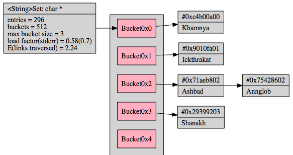
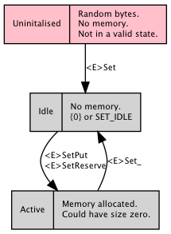

# set\.h #

## Hash Set ##

 * [Description](#user-content-preamble)
 * [Typedef Aliases](#user-content-typedef): [&lt;PE&gt;uint](#user-content-typedef-3716ff1a), [&lt;PE&gt;type](#user-content-typedef-ab069276), [&lt;PE&gt;mtype](#user-content-typedef-421a8659), [&lt;PE&gt;hash_fn](#user-content-typedef-4bb6ea9f), [&lt;PE&gt;is_equal_fn](#user-content-typedef-2a8c8832), [&lt;PE&gt;replace_fn](#user-content-typedef-39f65d37), [&lt;PA&gt;to_string_fn](#user-content-typedef-a933c596), [&lt;PE&gt;action_fn](#user-content-typedef-50206e09)
 * [Struct, Union, and Enum Definitions](#user-content-tag): [&lt;E&gt;set_node](#user-content-tag-ff4c0209), [&lt;E&gt;set](#user-content-tag-2ba39e24), [&lt;PE&gt;iterator](#user-content-tag-bb8cb7dc)
 * [Function Summary](#user-content-summary)
 * [Function Definitions](#user-content-fn)
 * [License](#user-content-license)

## <a id = "user-content-preamble" name = "user-content-preamble">Description</a> ##

[&lt;E&gt;set](#user-content-tag-2ba39e24) is a collection of elements of [&lt;E&gt;set_node](#user-content-tag-ff4c0209) that doesn't allow duplication; it must be supplied an equality function, `SET_IS_EQUAL` [&lt;PE&gt;is_equal_fn](#user-content-typedef-2a8c8832), and a hash function, `SET_HASH` [&lt;PE&gt;hash_fn](#user-content-typedef-4bb6ea9f)\.

Internally, it is a separately chained hash table with a maximum load factor of `ln 2`, power\-of\-two resizes, with buckets as a forward linked list of [&lt;E&gt;set_node](#user-content-tag-ff4c0209)\. This offers some independence of sets from set elements\. It can be expanded to an associative array by enclosing the `<E>set_node` in another `struct`\.

`<E>set` is not synchronised\. Errors are returned with `errno`\. The parameters are `#define` preprocessor macros, and are all undefined at the end of the file for convenience\. `assert.h` is used; to stop assertions, use `#define NDEBUG` before inclusion\.

 * Parameter: SET\_NAME, SET\_TYPE  
   `<E>` that satisfies `C` naming conventions when mangled and a valid [&lt;PE&gt;type](#user-content-typedef-ab069276) associated therewith; required\. `<PE>` is private, whose names are prefixed in a manner to avoid collisions; any should be re\-defined prior to use elsewhere\.
 * Parameter: SET\_HASH  
   A function satisfying [&lt;PE&gt;hash_fn](#user-content-typedef-4bb6ea9f); required\.
 * Parameter: SET\_IS\_EQUAL  
   A function satisfying [&lt;PE&gt;is_equal_fn](#user-content-typedef-2a8c8832); required\.
 * Parameter: SET\_POINTER  
   Usually [&lt;PE&gt;mtype](#user-content-typedef-421a8659) in the same as [&lt;PE&gt;type](#user-content-typedef-ab069276) for simple `SET_TYPE`, but this flag makes `<PE>mtype` be a pointer\-to\-`<PE>type`\. This affects [&lt;PE&gt;hash_fn](#user-content-typedef-4bb6ea9f), [&lt;PE&gt;is_equal_fn](#user-content-typedef-2a8c8832), and [&lt;E&gt;set_get](#user-content-fn-f8b4af93), making them accept a pointer\-to\-const\-`<E>` instead of a copy of `<E>`\.
 * Parameter: SET\_UINT  
   This is [&lt;PE&gt;uint](#user-content-typedef-3716ff1a) and defaults to `unsigned int`; use when [&lt;PE&gt;hash_fn](#user-content-typedef-4bb6ea9f) is a specific hash length\.
 * Parameter: SET\_NO\_CACHE  
   Calculates the hash every time and discards it; should be used when the hash calculation is trivial to avoid storing duplicate [&lt;PE&gt;uint](#user-content-typedef-3716ff1a) _per_ datum, \(in rare cases\.\)
 * Parameter: SET\_EXPECT\_TRAIT  
   Do not un\-define certain variables for subsequent inclusion in a trait\.
 * Parameter: SET\_TO\_STRING  
   To string trait contained in [to\_string\.h](to_string.h); `<A>` that satisfies `C` naming conventions when mangled and function implementing [&lt;PA&gt;to_string_fn](#user-content-typedef-a933c596)\. There can be multiple to string traits, but only one can omit `SET_TO_STRING_NAME`\.
 * Parameter: SET\_TEST  
   To string trait contained in [\.\./test/set\_test\.h](../test/set_test.h); optional unit testing framework using `assert`\. Can only be defined once _per_ set\. Must be defined equal to a \(random\) filler function, satisfying [&lt;PE&gt;action_fn](#user-content-typedef-50206e09)\. Output will be shown with the to string trait in which it's defined; provides tests for the base code and all later traits\.
 * Standard:  
   C89
 * See also:  
   [array](https://github.com/neil-edelman/array); [heap](https://github.com/neil-edelman/heap); [list](https://github.com/neil-edelman/list); [orcish](https://github.com/neil-edelman/orcish); [pool](https://github.com/neil-edelman/pool); [trie](https://github.com/neil-edelman/trie)

## <a id = "user-content-typedef" name = "user-content-typedef">Typedef Aliases</a> ##

### <a id = "user-content-typedef-3716ff1a" name = "user-content-typedef-3716ff1a">&lt;PE&gt;uint</a> ###

<code>typedef SET_UINT <strong>&lt;PE&gt;uint</strong>;</code>

Valid unsigned integer type used for hash values\. The hash map will saturate at `min(((ln 2)/2) &#183; range(<PE>uint), (1/8) &#183; range(size_t))`, at which point no new buckets can be added and the load factor will increase over the maximum\.

### <a id = "user-content-typedef-ab069276" name = "user-content-typedef-ab069276">&lt;PE&gt;type</a> ###

<code>typedef SET_TYPE <strong>&lt;PE&gt;type</strong>;</code>

Valid tag type defined by `SET_TYPE`\. Included in [&lt;E&gt;set_node](#user-content-tag-ff4c0209)\.

### <a id = "user-content-typedef-421a8659" name = "user-content-typedef-421a8659">&lt;PE&gt;mtype</a> ###

<code>typedef const &lt;PE&gt;type *<strong>&lt;PE&gt;mtype</strong>;</code>

`SET_POINTER` modifies `<PE>mtype` to be a pointer, otherwise it's the same as [&lt;PE&gt;type](#user-content-typedef-ab069276)\.

### <a id = "user-content-typedef-4bb6ea9f" name = "user-content-typedef-4bb6ea9f">&lt;PE&gt;hash_fn</a> ###

<code>typedef &lt;PE&gt;uint(*<strong>&lt;PE&gt;hash_fn</strong>)(const &lt;PE&gt;mtype);</code>

A map from [&lt;PE&gt;mtype](#user-content-typedef-421a8659) onto [&lt;PE&gt;uint](#user-content-typedef-3716ff1a)\. Should be as close as possible to a discrete uniform distribution while using all argument for maximum performance\.

### <a id = "user-content-typedef-2a8c8832" name = "user-content-typedef-2a8c8832">&lt;PE&gt;is_equal_fn</a> ###

<code>typedef int(*<strong>&lt;PE&gt;is_equal_fn</strong>)(const &lt;PE&gt;mtype a, const &lt;PE&gt;mtype b);</code>

Equivalence relation between [&lt;PE&gt;mtype](#user-content-typedef-421a8659) that satisfies `<PE>is_equal_fn(a, b) -> <PE>hash_fn(a) == <PE>hash_fn(b)`\.

### <a id = "user-content-typedef-39f65d37" name = "user-content-typedef-39f65d37">&lt;PE&gt;replace_fn</a> ###

<code>typedef int(*<strong>&lt;PE&gt;replace_fn</strong>)(&lt;PE&gt;type *original, &lt;PE&gt;type *replace);</code>

A di\-predicate; returns true if the `replace` replaces the `original`\.

### <a id = "user-content-typedef-a933c596" name = "user-content-typedef-a933c596">&lt;PA&gt;to_string_fn</a> ###

<code>typedef void(*<strong>&lt;PA&gt;to_string_fn</strong>)(const &lt;PA&gt;type *, char(*)[12]);</code>

Responsible for turning the first argument into a 12\-`char` null\-terminated output string\.

### <a id = "user-content-typedef-50206e09" name = "user-content-typedef-50206e09">&lt;PE&gt;action_fn</a> ###

<code>typedef void(*<strong>&lt;PE&gt;action_fn</strong>)(&lt;PE&gt;type *);</code>

Operates by side\-effects\. Used for `SET_TEST`\.

## <a id = "user-content-tag" name = "user-content-tag">Struct, Union, and Enum Definitions</a> ##

### <a id = "user-content-tag-ff4c0209" name = "user-content-tag-ff4c0209">&lt;E&gt;set_node</a> ###

<code>struct <strong>&lt;E&gt;set_node</strong>;</code>

Contains [&lt;PE&gt;type](#user-content-typedef-ab069276) as the first element `key`, along with data internal to the set\. Storage of the `<E>set_node` structure is the responsibility of the caller\.

### <a id = "user-content-tag-2ba39e24" name = "user-content-tag-2ba39e24">&lt;E&gt;set</a> ###

<code>struct <strong>&lt;E&gt;set</strong>;</code>

An `<E>set` of `size`\. To initialise, see [&lt;E&gt;set](#user-content-fn-2ba39e24), `SET_IDLE`, `{0}` \(`C99`,\) or being `static`\.

### <a id = "user-content-tag-bb8cb7dc" name = "user-content-tag-bb8cb7dc">&lt;PE&gt;iterator</a> ###

<code>struct <strong>&lt;PE&gt;iterator</strong>;</code>

Contains all iteration parameters\.

## <a id = "user-content-summary" name = "user-content-summary">Function Summary</a> ##

<table>

<tr><th>Modifiers</th><th>Function Name</th><th>Argument List</th></tr>

<tr><td align = right>static void</td><td><a href = "#user-content-fn-2ba39e24">&lt;E&gt;set</a></td><td>set</td></tr>

<tr><td align = right>static void</td><td><a href = "#user-content-fn-2d927ba1">&lt;E&gt;set_</a></td><td>set</td></tr>

<tr><td align = right>static void</td><td><a href = "#user-content-fn-3a5e75d6">&lt;E&gt;set_clear</a></td><td>set</td></tr>

<tr><td align = right>static struct &lt;E&gt;set_node *</td><td><a href = "#user-content-fn-f8b4af93">&lt;E&gt;set_get</a></td><td>set, data</td></tr>

<tr><td align = right>static int</td><td><a href = "#user-content-fn-a31434f">&lt;E&gt;set_reserve</a></td><td>set, reserve</td></tr>

<tr><td align = right>static struct &lt;E&gt;set_node *</td><td><a href = "#user-content-fn-a9605382">&lt;E&gt;set_put</a></td><td>set, element</td></tr>

<tr><td align = right>static struct &lt;E&gt;set_node *</td><td><a href = "#user-content-fn-554e65">&lt;E&gt;set_policy_put</a></td><td>set, element, replace</td></tr>

<tr><td align = right>static struct &lt;E&gt;set_node *</td><td><a href = "#user-content-fn-9b46fcb1">&lt;E&gt;set_remove</a></td><td>set, data</td></tr>

<tr><td align = right>static const char *</td><td><a href = "#user-content-fn-6fb489ab">&lt;A&gt;to_string</a></td><td>box</td></tr>

<tr><td align = right>static void</td><td><a href = "#user-content-fn-db3bf859">&lt;E&gt;set_test</a></td><td>parent_new, parent</td></tr>

</table>

## <a id = "user-content-fn" name = "user-content-fn">Function Definitions</a> ##

### <a id = "user-content-fn-2ba39e24" name = "user-content-fn-2ba39e24">&lt;E&gt;set</a> ###

<code>static void <strong>&lt;E&gt;set</strong>(struct &lt;E&gt;set *const <em>set</em>)</code>

Initialises `set` to idle\.

 * Order:  
   &#920;\(1\)

### <a id = "user-content-fn-2d927ba1" name = "user-content-fn-2d927ba1">&lt;E&gt;set_</a> ###

<code>static void <strong>&lt;E&gt;set_</strong>(struct &lt;E&gt;set *const <em>set</em>)</code>

Destroys `set` and returns it to idle\.

### <a id = "user-content-fn-3a5e75d6" name = "user-content-fn-3a5e75d6">&lt;E&gt;set_clear</a> ###

<code>static void <strong>&lt;E&gt;set_clear</strong>(struct &lt;E&gt;set *const <em>set</em>)</code>

Clears and removes all entries from `set`\. The capacity and memory of the hash table is preserved, but all previous values are un\-associated\. The load factor will be less until it reaches it's previous size\.

 * Parameter: _set_  
   If null, does nothing\.
 * Order:  
   &#920;\(`set.buckets`\)

### <a id = "user-content-fn-f8b4af93" name = "user-content-fn-f8b4af93">&lt;E&gt;set_get</a> ###

<code>static struct &lt;E&gt;set_node *<strong>&lt;E&gt;set_get</strong>(struct &lt;E&gt;set *const <em>set</em>, const &lt;PE&gt;mtype <em>data</em>)</code>

 * Parameter: _set_  
   If null, returns null\.
 * Return:  
   The value in `set` which [&lt;PE&gt;is_equal_fn](#user-content-typedef-2a8c8832) `SET_IS_EQUAL` `data`, or, if no such value exists, null\.
 * Order:  
   Average &#927;\(1\), \(hash distributes elements uniformly\); worst &#927;\(n\)\.

### <a id = "user-content-fn-a31434f" name = "user-content-fn-a31434f">&lt;E&gt;set_reserve</a> ###

<code>static int <strong>&lt;E&gt;set_reserve</strong>(struct &lt;E&gt;set *const <em>set</em>, const size_t <em>reserve</em>)</code>

Reserve at least `reserve`, divided by the maximum load factor, space in the buckets of `set`\.

 * Return:  
   Success\.
 * Exceptional return: ERANGE  
   `reserve` plus the size would take a bigger number then could fit in a `size_t`\.
 * Exceptional return: realloc  

### <a id = "user-content-fn-a9605382" name = "user-content-fn-a9605382">&lt;E&gt;set_put</a> ###

<code>static struct &lt;E&gt;set_node *<strong>&lt;E&gt;set_put</strong>(struct &lt;E&gt;set *const <em>set</em>, struct &lt;E&gt;set_node *const <em>element</em>)</code>

Puts the `element` in `set`\.

 * Parameter: _set_  
   If null, returns null\.
 * Parameter: _element_  
   If null, returns null\. Should not be of a set because the integrity of that set will be compromised\.
 * Return:  
   Any ejected element or null\. \(An ejected element has [&lt;PE&gt;is_equal_fn](#user-content-typedef-2a8c8832) `SET_IS_EQUAL` the `element`\.\)
 * Exceptional return: realloc, ERANGE  
   There was an error with a re\-sizing\. Successfully calling [&lt;E&gt;set_reserve](#user-content-fn-a31434f) with at least one before ensures that this does not happen\.
 * Order:  
   Average amortised &#927;\(1\), \(hash distributes elements uniformly\); worst &#927;\(n\)\.

### <a id = "user-content-fn-554e65" name = "user-content-fn-554e65">&lt;E&gt;set_policy_put</a> ###

<code>static struct &lt;E&gt;set_node *<strong>&lt;E&gt;set_policy_put</strong>(struct &lt;E&gt;set *const <em>set</em>, struct &lt;E&gt;set_node *const <em>element</em>, const &lt;PE&gt;replace_fn <em>replace</em>)</code>

Puts the `element` in `set` only if the entry is absent or if calling `replace` returns true\.

 * Parameter: _set_  
   If null, returns null\.
 * Parameter: _element_  
   If null, returns null\. Should not be of a set because the integrity of that set will be compromised\.
 * Parameter: _replace_  
   Called on collision and only replaces it if the function returns true\. If null, doesn't do any replacement on collision\.
 * Return:  
   Any ejected element or null\. On collision, if `replace` returns false or `replace` is null, returns `element` and leaves the other element in the set\.
 * Exceptional return: realloc, ERANGE  
   There was an error with a re\-sizing\. Successfully calling [&lt;E&gt;set_reserve](#user-content-fn-a31434f) with at least one before ensures that this does not happen\.
 * Order:  
   Average amortised &#927;\(1\), \(hash distributes elements uniformly\); worst &#927;\(n\)\.

### <a id = "user-content-fn-9b46fcb1" name = "user-content-fn-9b46fcb1">&lt;E&gt;set_remove</a> ###

<code>static struct &lt;E&gt;set_node *<strong>&lt;E&gt;set_remove</strong>(struct &lt;E&gt;set *const <em>set</em>, const &lt;PE&gt;mtype <em>data</em>)</code>

Removes an element `data` from `set`\.

 * Return:  
   Successfully ejected element or null\. This element is free to be put into another set or modify it's hash values\.
 * Order:  
   Average &#927;\(1\), \(hash distributes elements uniformly\); worst &#927;\(n\)\.

### <a id = "user-content-fn-6fb489ab" name = "user-content-fn-6fb489ab">&lt;A&gt;to_string</a> ###

<code>static const char *<strong>&lt;A&gt;to_string</strong>(const &lt;PA&gt;box *const <em>box</em>)</code>

 * Return:  
   Print the contents of `box` in a static string buffer of 256 bytes with limitations of only printing 4 things at a time\.
 * Order:  
   &#920;\(1\)

### <a id = "user-content-fn-db3bf859" name = "user-content-fn-db3bf859">&lt;E&gt;set_test</a> ###

<code>static void <strong>&lt;E&gt;set_test</strong>(struct &lt;E&gt;set_node *(*const <em>parent_new</em>)(void *), void *const <em>parent</em>)</code>

The list will be tested on `stdout`\. Requires `SET_TEST` to be a [&lt;PE&gt;action_fn](#user-content-typedef-50206e09) and `SET_TO_STRING`\.

 * Parameter: _parent\_new_  
   Specifies the dynamic up\-level creator of the parent `struct`\. Could be null; then testing will be done statically on an array of [&lt;E&gt;set_node](#user-content-tag-ff4c0209) and `SET_TEST` is not allowed to go over the limits of the data type\.
 * Parameter: _parent_  
   The parameter passed to `parent_new`\. Ignored if `parent_new` is null\.

## <a id = "user-content-license" name = "user-content-license">License</a> ##

2019 Neil Edelman, distributed under the terms of the [MIT License](https://opensource.org/licenses/MIT)\.

